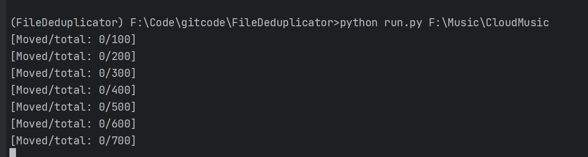

# FileDeduplicator

文件去重。

##### 1.使用说明

- `Python` ≥ 3.6
- 原理：
  - 计算给定范围内的每个文件的hash值，hash相同的下一个文件，会被移动到与给定目录同级的backup文件夹内
- 本程序为多线程程序
- 默认的目录最大搜索深度为7，
    - 根目录下深度为0，根目录的目录深度为2，...，依次类推

##### 2. 使用方法

```bash
# 没有python3
python3 run.py your_file_dir_path
```

##### 3.案例



---
